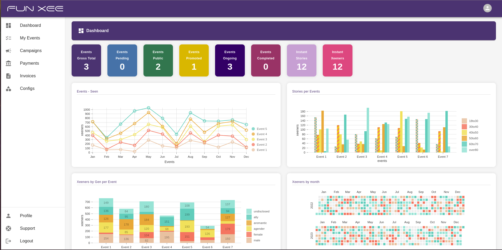

# Chart Portfolio

## Short portfolio with some screenshots of charts I created in my last 3 projects... 

1. Funxee project. The dashboard analytics charts. (Nivo and D3)

2. Chart of integration of Vaillant heating boiler with the outside and two floors' temperature variations (Apex Charts)

3. United Nations - Bar (D3)

4. Lennar Corp - BI on the medium screens

5. Lennar Corp - BI on the huge screens

6. Lennar Corp - Column and candlestick/box (D3)

7. Lennar Corp - Sunburst and column (D3)

8. Lennar Corp - Stacked splines, bars, and sunburst (D3)

9. Lennar Corp - Chunks on map (Mapbox and D3)

10. Lennar Corp - Stacked histogram and others (D3)

11. Lennar Corp - Clusters on map (Mapbox and D3)

